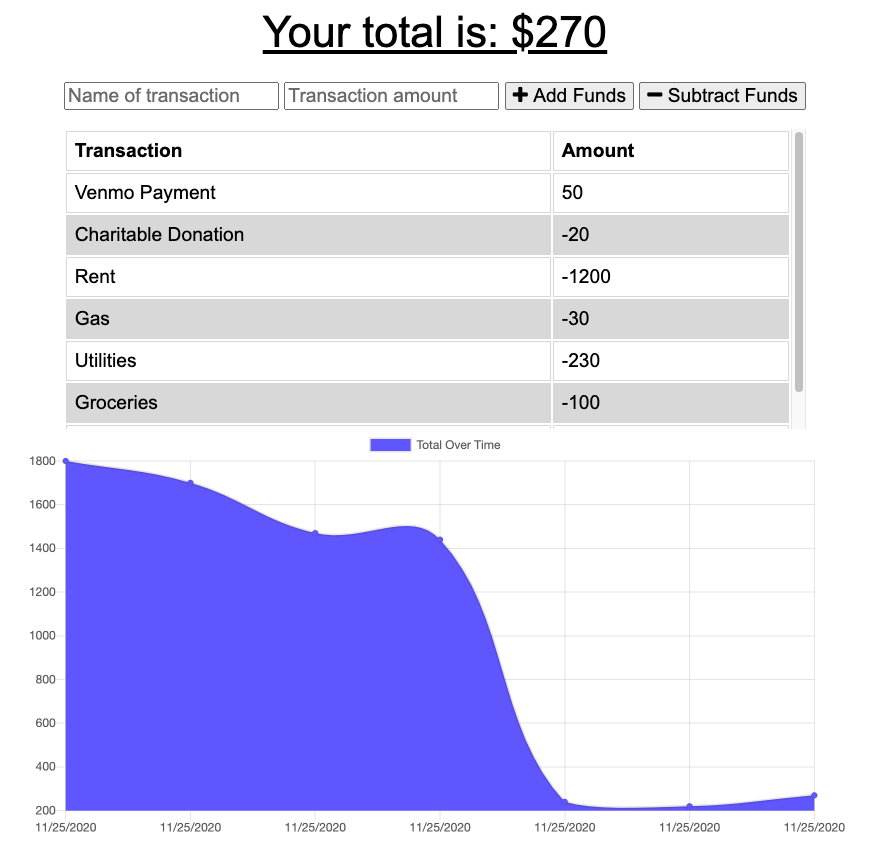

# PWA Budget Tracker


## Table of Contents
* [Description](#description)
* [Installation](#installation)
* [Usage](#usage)
* [Tests](#test)
* [Questions](#questions)
* [Contributing Authors](#contributors)
* [License](#license)

# Description
A PWA budget tracker with a Mongo database, Mongoose schema, and uses Express to handle routes. The front end code was provided. With this application, a user is able to track withdraws and deposits with or without a data/internet connection. This gives users a fast and easy way to track their money and allowing them to access that information anytime with offline functionality. 

* <a href="https://secret-journey-29132.herokuapp.com/">Link to Deployed App on Heroku.</a>


    
## Installation
To use application from your local environment, you must accomplish the following steps below:

**Step 1 - Clone my repo using the command line below.**
```
git clone git@github.com:cascutter/PWA-Budget-Tracker.git
```
**Step 2 - Change directory to the cloned repo folder.**
```
cd PWA-Budget-Tracker
```
**Step 3 - Install all required NPM packages.**
```
npm install
npm install mongoose
npm install express
npm install morgan
```
**Step 4 - Start the application server using the command line below**
```
node server.js
```
    
## Usage
The application allows users to accomplish the following tasks:

* Enter deposits on and offline

* Enter expenses on and offline

* When brought back online, offline entries persist


          
## Tests
All tests currently passing.

            
## Questions
All questions regarding this application can be directed to: 
 
<a href="https://github.com/cascutter">cascutter</a> 

<a href="mailto:cascutter13@gmail.com">cascutter13@gmail.com</a>
    
# Contributing Authors
* Casandra Cutter (functionality)
* Trilogy Edu (existing application)
    
# License
ISC License